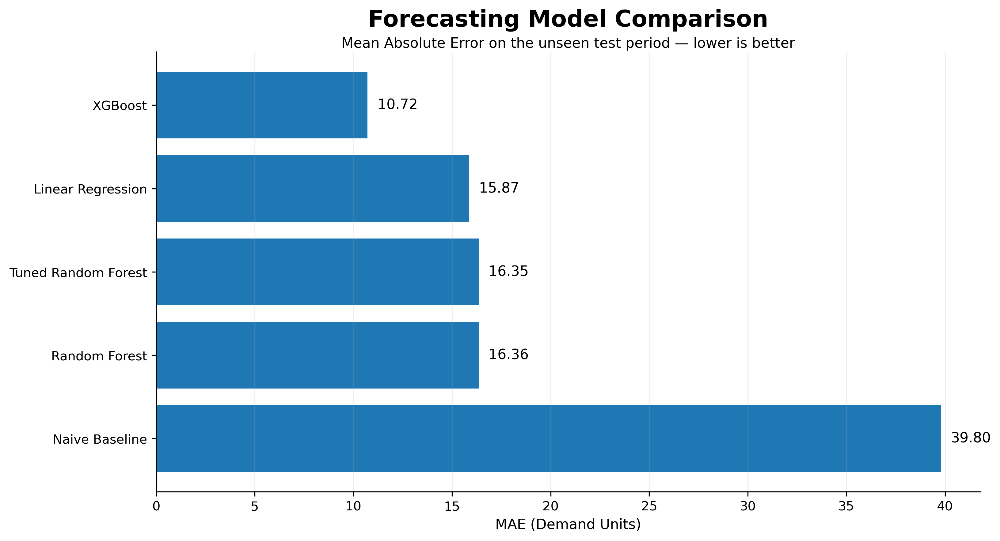
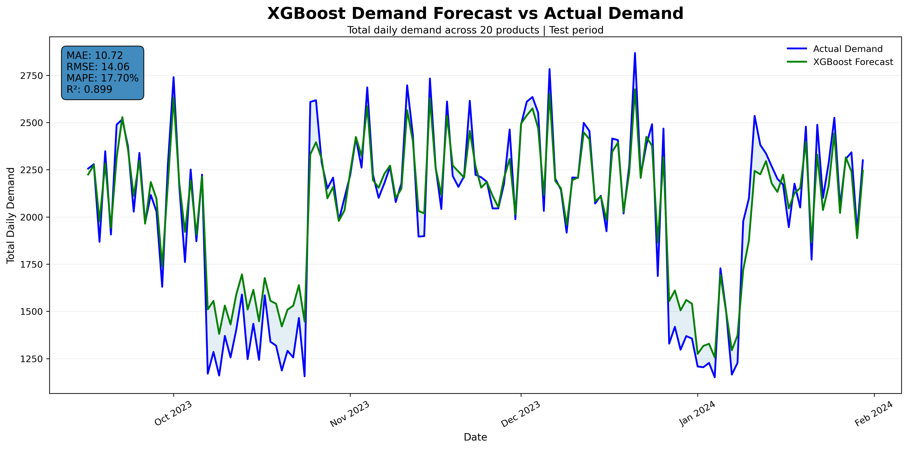

# Retail Demand Forecasting & Inventory Planning

End-to-end retail analytics project combining **demand forecasting, machine learning explainability and inventory planning** to support data-driven replenishment decisions.

The project goes beyond predicting demand: forecasts are translated into **safety stock, replenishment recommendations and product prioritization**.

## Key Results

- **XGBoost R²:** 0.899
- **XGBoost MAE:** 10.72 units
- **Service level:** 91.1% → 98.8%
- **Total shortage:** 3,200 → 226 units
- **Shortage reduction:** ~92.9%
- **20 products** analyzed for inventory planning

---

## Forecasting Results

XGBoost clearly outperformed the naive baseline, Linear Regression and Random Forest models.



The final model closely follows the actual aggregated demand during the unseen test period.



---

## Business Problem

Retail inventory planning requires balancing two competing risks:

- **Stockouts**, which may result in lost sales and lower service levels.
- **Excess inventory**, which increases stock exposure and operational inefficiency.

The objective of this project is therefore to:

1. Forecast future daily product demand.
2. Understand the main drivers behind the predictions.
3. Translate forecasts into inventory replenishment decisions.
4. Prioritize products according to commercial importance and forecasting uncertainty.

---

## Dataset

The dataset contains **76,000 daily observations** covering:

- 5 stores
- 20 products
- 5 product categories
- 760 days
- January 2022 – January 2024

Variables include:

- Demand
- Price
- Discount
- Promotion
- Inventory Level
- Units Sold
- Units Ordered
- Product Category
- Seasonality
- Weather Condition
- Competitor Pricing

For the detailed forecasting exercise, store `S003` was selected as a representative store, resulting in **15,200 observations across 20 product-level time series**.

**Dataset source:** [Original dataset](https://www.kaggle.com/datasets/atomicd/retail-store-inventory-and-demand-forecasting)

The dataset is distributed under the **Apache License 2.0**.

The raw dataset is not included in this repository. Download instructions are available in [`data/README.md`](data/README.md).

---

## Methodology

The project follows an end-to-end analytics workflow:

### 1. Data Understanding & Preparation

- Data quality and completeness checks
- Duplicate and missing-value analysis
- Daily-frequency validation
- Chronological ordering of product time series
- Identification of potential outliers

### 2. Exploratory Data Analysis

The analysis explored:

- Store-level demand behavior
- Product-level demand variability
- Promotions and discounts
- Product categories and seasonality
- Autocorrelation
- Stationarity
- Periodic demand patterns

A particularly interesting result was a dominant **~76-day cyclical pattern** for product `P0006`.

### 3. Feature Engineering

The forecasting model uses:

**Historical demand features**
- Lags: 1, 2, 7, 14, 30 and 76 days
- Rolling means: 7, 14 and 30 days
- 7-day rolling standard deviation

**Calendar features**
- Day of week
- Month
- Week of year
- Weekend indicator

**Commercial and product features**
- Product
- Category
- Price
- Discount
- Promotion
- Seasonality

`Inventory Level`, `Units Sold` and `Units Ordered` were excluded from the forecasting model to reduce temporal ambiguity and potential leakage.

---

## Forecasting Approach

The problem was formulated as **one-day-ahead supervised demand forecasting**.

A chronological train/test split was used rather than a random split to preserve the temporal structure of the data.

Four forecasting approaches were evaluated:

| Model | MAE | RMSE | MAPE | R² |
|---|---:|---:|---:|---:|
| Naive Baseline | 39.80 | 51.64 | 51.97% | -0.360 |
| Linear Regression | 15.87 | 21.62 | 25.22% | 0.762 |
| Random Forest | 16.36 | 23.09 | 27.00% | 0.728 |
| Tuned Random Forest | 16.35 | 23.11 | 27.06% | 0.728 |
| **XGBoost** | **10.72** | **14.06** | **17.70%** | **0.899** |

**XGBoost achieved the strongest overall performance** and was selected as the final forecasting model.

---

## Model Explainability

Feature importance and SHAP analysis were used to understand model behavior.

Relevant predictive signals included:

- Price
- Discount
- Promotion
- Recent rolling demand
- Product identity
- Product category
- Seasonality

These relationships are interpreted as **predictive associations rather than causal effects**.

Forecast performance was also evaluated individually across the 20 products. All products achieved an R² above approximately **0.81**, although some products, particularly `P0006`, retained greater residual uncertainty.

---

## Inventory Planning

Forecasts were translated into a simple replenishment framework:

> **Target Stock = Forecast Demand + Safety Stock**

> **Recommended Order = max(Target Stock − Previous Inventory, 0)**

Safety stock was estimated separately for each product using **out-of-sample forecast errors generated through temporal validation within the training period**.

This avoids using the final test period to determine inventory buffers.

### Safety Stock Policy

Several uncertainty percentiles were evaluated:

| Policy | Service Level | Total Shortage | Avg. Excess Stock | Total Ordered |
|---|---:|---:|---:|---:|
| No Safety Stock | 91.09% | 3,200 | 217.24 | 14,065 |
| 75th percentile | 94.74% | 1,409 | 218.12 | 18,250 |
| 90th percentile | 97.48% | 536 | 219.51 | 22,932 |
| **95th percentile** | **98.80%** | **226** | **221.13** | **27,685** |
| 99th percentile | 99.82% | 35 | 226.50 | 42,609 |

The **95th-percentile policy** was selected as a service-oriented scenario.

Compared with forecasting without safety stock, it:

- Increased service level from **91.09% to 98.80%**
- Reduced shortages from **3,200 to 226 units**
- Reduced total shortage by approximately **92.9%**

This policy should not be interpreted as an economic optimum because holding costs, ordering costs and stockout penalties are not available in the dataset.

---

## ABC Inventory Classification

Two ABC approaches were explored.

### Demand-Volume ABC

The first classification ranked products according to total forecasted demand.

Demand was relatively evenly distributed across the portfolio, meaning that **15 of the 20 products were required to represent approximately 80% of total forecasted demand**.

This provided limited differentiation.

### Value-Based ABC

A second classification incorporated both demand and selling price:

> **Forecasted Sales Value = Predicted Demand × Price**

This produced a more useful commercial segmentation:

- **Class A:** 12 products → ~80.2% of forecasted sales value
- **Class B:** 5 products → ~16.2%
- **Class C:** 3 products → ~3.6%

The result shows that products with the highest expected demand are not necessarily those with the highest expected commercial value.

---

## Operational Product Prioritization

As a final step, the value-based ABC classification was combined with product-level forecasting uncertainty.

Relative uncertainty was calculated as:

> **Safety Stock Ratio = Safety Stock / Average Forecast Demand**

This makes safety-stock requirements comparable across products with different demand levels.

Products were then assigned operational priorities according to their commercial importance and forecasting uncertainty.

`P0009` was identified as the only **Critical** SKU because it combines:

- Class A commercial importance
- High relative forecasting uncertainty

Several Class B products also showed high uncertainty, demonstrating that ABC classification alone does not fully capture operational inventory risk.

---

## Key Business Insights

- Machine learning substantially improves demand forecasting compared with a simple previous-day baseline.
- XGBoost achieved strong performance with an **R² of 0.899**.
- Forecast accuracy differs across products, making product-specific uncertainty management important.
- Forecast-driven safety stock can substantially reduce simulated stockout risk.
- Increasing safety stock improves service level but also increases replenishment and inventory exposure.
- Demand-volume ABC provided limited differentiation in this portfolio.
- Incorporating price produced a more informative value-based product prioritization.
- Combining **commercial value + forecasting uncertainty** provides a more useful operational framework than either metric alone.

---

## Technologies

- Python
- Pandas
- NumPy
- Matplotlib
- SciPy
- Statsmodels
- Scikit-learn
- XGBoost
- SHAP
- Jupyter / IPython

---

## Repository Structure

```text
retail-demand-forecasting-inventory-planning/
│
├── README.md
├── notebooks/
│   └── retail_demand_forecasting_inventory_planning.ipynb
│
├── images/
│   ├── forecast_vs_actual.png
│   └── model_comparison.png
│
├── data/
│   └── README.md
│
├── requirements.txt
└── .gitignore
```

---

## How to Run

### 1. Clone the repository

```bash
git clone <repository-url>
cd retail-demand-forecasting-inventory-planning
```

### 2. Install the dependencies

```bash
pip install -r requirements.txt
```

### 3. Download the dataset

Download the original dataset following the instructions in:

```text
data/README.md
```

Save it locally as:

```text
data/sales_data.csv
```

### 4. Run the notebook

Open:

```text
notebooks/retail_demand_forecasting_inventory_planning.ipynb
```

using your preferred Jupyter-compatible environment and run the notebook from top to bottom.

---

## Limitations

The results should be interpreted considering several limitations:

- Detailed modeling focuses on a single representative store.
- Forecasting is designed as a **one-day-ahead** problem.
- `Demand` is an estimated variable rather than directly observed customer demand.
- Commercial variables are predictive signals and should not be interpreted causally.
- Supplier lead times are not available.
- The inventory simulation assumes replenishment is available before same-day demand.
- Holding, ordering and stockout costs are not provided.
- The proposed inventory policy is therefore an analytical planning scenario rather than a mathematically optimal inventory solution.
- Value-based ABC uses selling price rather than unit cost.

---

## Future Work

Possible extensions include:

- Multi-store demand forecasting
- 7-day and 30-day forecasting horizons
- Probabilistic forecasting and prediction intervals
- Dynamic safety stock policies
- Supplier lead-time modeling
- Holding and stockout cost optimization
- Additional contextual variables
- Model monitoring and periodic retraining
- Comparison with dedicated time-series and deep-learning models

---

## Author

**Paul Montero**

Data Analytics · Business Analytics · Demand Forecasting · Inventory Planning
